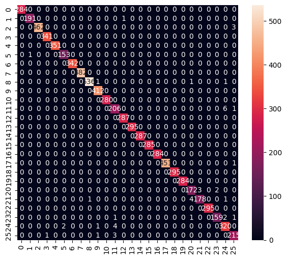

# FingerSpell <!-- omit from toc -->

Finger Spelling Practice in Python

**Table of Contents**

- [Project Description](#project-description)
- [Setup](#setup)
- [Development Approach](#development-approach)
- [Sources Cited](#sources-cited)


**Authors:**

- Andrii Rak
- Yuliia Medun
- [Aaron Ciuffo](https://txoof.github.io/cv_resume/)

## Project Description

This project offers Nederlanse Gebaren Taal Vingeralfabet (NGT Finger Alphabet) training for beginners. The model signs are based on the examples provided by [Wapperkids YouTube Video](https://www.youtube.com/watch?v=GMi9qDSw2o8).

## Setup

This assumes a basic comfort with Python, creating virtual environments and working on the command line. 

**Requirements**

- Web Camera
- Python 3.10 environment

### Environment Setup & Launch

1. Create a virtual environment for this project: `python3.10 -m venv fingerspell_venv`
2. Activate the virtual env: `source ./fingerspell_venv/bin/activate`
3. Install required packages: `pip install -r requirements.txt`
4. Launch the application: `./fingerspell.py`

## Development Approach

### The Challenge

The primary technical challenge in NGT fingerspelling recognition is distinguishing between static and dynamic letters:

- **Static letters** (A, B, C, D, E, F, G, I, K, L, M, N, O, P, Q, R, S, T, V, W, Y): Finger and hand positions remain fixed once the letter is formed. These can be recognized from a single frame.
- **Dynamic letters** (H, J, U, X, Z): The hand sign is formed with fingers in a static shape, but the entire hand moves, twists, or rotates in one or more planes and axes. These require temporal information to recognize correctly.

### Technical Background

This project uses two types of machine learning models:

- **Convolutional Neural Networks (CNN)**: Deep learning models that excel at pattern recognition in data. CNNs are very good at recognizing features like shapes and forms automatically but require substantial training time and computational resources.
- **Random Forest**: Models that make predictions by combining multiple decisions. They train quickly and work well with structured numerical data like hand landmark coordinates.

### Initial Development Timeline

Initial development took place from January 19-22, 2026, progressing through four iterations. Work continued through 30 January, adding features and improving performance.

#### Iteration 1: Proof of Concept (Random Forest)

- Collected approximately 200 samples per static letter and 400 samples per dynamic letter. 
- Trained a single Random Forest classifier on MediaPipe hand landmarks (21 3D points = 63 features). 
- Results showed high accuracy and fast training times, validating the approach for static letters.

#### Iteration 2: Dual Model System

- Created separate Random Forest models for static and dynamic letters. 
- Implemented a basic supervisor component to route predictions based on hand movement detected in individual frames.
- Static letters performed well, but dynamic letter accuracy remained low due to insufficient motion information.

#### Iteration 3: Neural Network Approach

We wanted to explore existing solutions and datasets to avoid "reinventing the wheel". We found the [ashgadala/american-sign-language-detection](https://github.com/ashgadala/american-sign-language-detection) ASL fingerspelling recognition project to be a good jumping off point for trying CNN models.

- Adopted code and data structure from the [ASL](https://github.com/ashgadala/american-sign-language-detection) detection project.
- Collected new training data for NGT letters that differ from ASL (approximately 60% of the alphabet). 
- Trained a CNN achieving 99% overall accuracy with excellent precision, recall, and F1 scores across all letters.

**CNN Classification Results:**

```text
              precision    recall  f1-score   support
    accuracy                           0.99      7891
   macro avg       0.99      0.99      0.99      7891
weighted avg       0.99      0.99      0.99      7891
```



Despite strong performance metrics, the CNN approach had critical limitations:

- Dynamic letters registered intermittently because the model received individual frames without temporal context
- No frame buffering was implemented to capture motion patterns
- Training required significant time (minutes to hours), making rapid iteration difficult
- Implementing context windows (concatenating multiple frames) felt overly complex for the project timeline

#### Iteration 4: Enhanced Dual Random Forest System (Final Solution)

Returned to the dual Random Forest approach with significant improvements to motion detection and feature engineering.

**Key Innovation - Delta Features:**

MediaPipe normalizes hand landmarks by setting the wrist as the origin, which removes absolute position information needed for motion detection. To capture movement, we implemented delta features that measure landmark position changes across a 5-frame window:

- Calculate the difference in each landmark's normalized position between consecutive frames
- Aggregate these differences to detect movement across all 21 hand joints
- High delta values indicate motion is occurring

The motion detection system uses two metrics:

1. **Total landmark displacement**: Sum of all position changes across all joints
2. **Absolute wrist displacement**: Movement of the wrist in the original (non-normalized) coordinate space

This dual-metric approach achieves 96.7% accuracy in classifying frames as static or dynamic motion.

**Model Architecture:**

```text
Camera Feed
     |
     v
MediaPipe Hand Detection
     |
     v
Motion Detection (5-frame buffer)
     |
     v
Supervisor Component
     |
     +-- Static motion detected --> Static Random Forest (21 letters, 42 features)
     |
     +-- Dynamic motion detected --> Dynamic Random Forest (5 letters, 84 features)
     |
     v
Letter Prediction
```

**Final Results:**

Static Letter Model (21 letters):

```text
              precision    recall  f1-score   support
weighted avg       1.00      0.99      0.99      8582
```

Dynamic Letter Model (5 letters):

```text
              precision    recall  f1-score   support
             H       1.00      1.00      1.00       805
             J       1.00      1.00      1.00       603
             U       1.00      1.00      1.00       516
             X       1.00      1.00      1.00       693
             Z       0.99      0.99      0.99       609

      accuracy                           1.00      3226
    macro avg       1.00      1.00      1.00      3226
 weighted avg       1.00      1.00      1.00      3226
```

### Continued Improvements

After the initial development phase, we continued to improve the product by doing the following:

- 22 Jan: Error analysis leads to adding additional data. We gathered max confidence scores and identified signs that had poor performance. The goal is to get >=70 for all signs across three users.

| Sign | Max AC | Max YM | Max AR | Average | Proposed Action                             |
| ---- | ------ | ------ | ------ | ------- | ------------------------------------------- |
| A    | 95     | 76     | 54     | 75      |                                             |
| B    | 54     | 73     | 65     | 64      | Everyone: remove existing & add new samples |
| C    | 100    | 91     | 80     | 90      |                                             |
| D    | 100    | 45     | 85     | 77      |                                             |
| E    | 89     | 85     | 85     | 86      |                                             |
| F    | 83     | 76     | 71     | 77      |                                             |
| G    | 62     | 57     | 60     | 60      | Everyone: remove existing & add new samples |
| H    | 100    | 47     | 79     | 75      |                                             |
| I    | 97     | 92     | 90     | 93      |                                             |
| J    | 86     | 94     | 80     | 87      |                                             |
| K    | 30     | 61     | 80     | 57      | Everyone: remove existing & add new samples |
| L    | 70     | 20     | 80     | 57      | Yuliia add new sampless                     |
| M    | 90     | 0      | 0      | 30      | Everyone: remove existing & add new samples |
| N    | 70     | 0      | 0      | 23      | Everyone: remove existing & add new samples |
| O    | 82     | 72     | 63     | 72      |                                             |
| P    | 97     | 41     | 41     | 60      | Everyone: remove existing & add new samples |
| Q    | 90     | 0      | 0      | 30      | Everyone: remove existing & add new samples |
| R    | 92     | 93     | 0      | 62      | Andrii add new sampless                     |
| S    | 99     | 70     | 60     | 76      |                                             |
| T    | 60     | 86     | 80     | 75      | Aaron add new sampless                      |
| U    | 100    | 100    | 91     | 97      |                                             |
| V    | 82     | 84     | 68     | 78      |                                             |
| W    | 99     | 90     | 82     | 90      |                                             |
| X    | 82     | 91     | 77     | 83      |                                             |
| Y    | 80     | 87     | 82     | 83      |                                             |
| Z    | 90     | 94     | 73     | 86      |                                             |

### Key Lessons

1. **Normalization matters**: MediaPipe's wrist-centered normalization is essential for position-invariant hand shape recognition, but it removes motion information. Capturing both normalized and raw coordinates solved this challenge.

2. **Delta features as motion proxy**: Computing position differences across frame windows provides an effective, interpretable way to capture movement patterns without complex temporal modeling.

3. **Model simplicity enables iteration**: Random Forest models train in seconds rather than minutes, allowing rapid experimentation with features, data collection strategies, and model architectures.

## Sources Cited

### References

| Source                                                                                                      | Description                                                               | Usage                                                                              | License                                                                                |
| ----------------------------------------------------------------------------------------------------------- | ------------------------------------------------------------------------- | ---------------------------------------------------------------------------------- | -------------------------------------------------------------------------------------- |
| [ashgadala/american-sign-language-detection](https://github.com/ashgadala/american-sign-language-detection) | ASL fingerspelling recognition dataset                                    | Used data structure and training data for letters that overlap between ASL and NGT | [MIT](https://github.com/ashgadala/american-sign-language-detection/blob/main/LICENSE) |
| [Wapperkids NLGebaren doe je zo ALFABET](https://www.youtube.com/watch?v=GMi9qDSw2o8)                       | Reference video demonstrating Dutch Sign Language fingerspelling alphabet | Used as reference material for correct NGT letter formation                        |                                                                                        |
| [NGT Handalfabet by Vera de Kok](https://nl.wikipedia.org/wiki/Bestand:NGT_handalfabet.webm)                | Reference video demonstrating Dutch Sign Language fingerspelling alphabet | Used as reference material for correct NGT letter formation                        | [CC BY-SA 4.0](https://creativecommons.org/licenses/by-sa/4.0/)                        |

### Fonts

This project includes DejaVu Sans font for Unicode text rendering:

**DejaVu Sans**
- License: DejaVu Fonts License (based on Bitstream Vera Fonts and Public Domain)
- Source: https://dejavu-fonts.github.io/
- Files: `assets/fonts/DejaVuSans.ttf`, `DejaVuSans-Bold.ttf`

The DejaVu fonts are free to use, modify, and distribute. See `[assets/fonts/DejaVu Fonts Licenses.txt](./assets/fonts/DejaVu Fonts License.txt)` for full license text.
