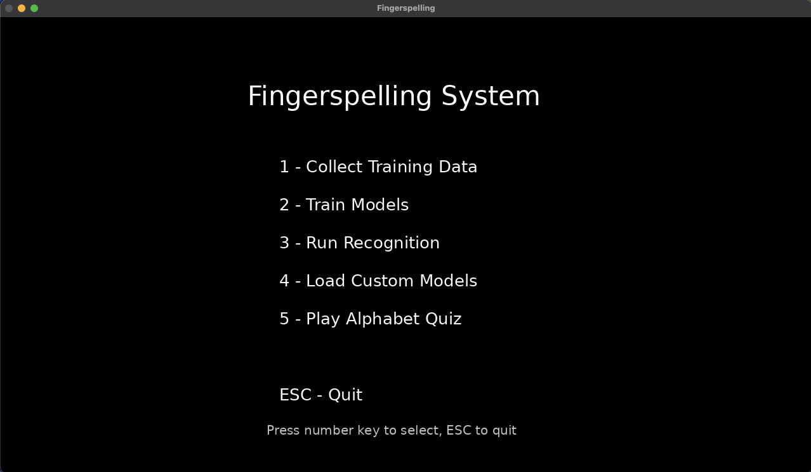
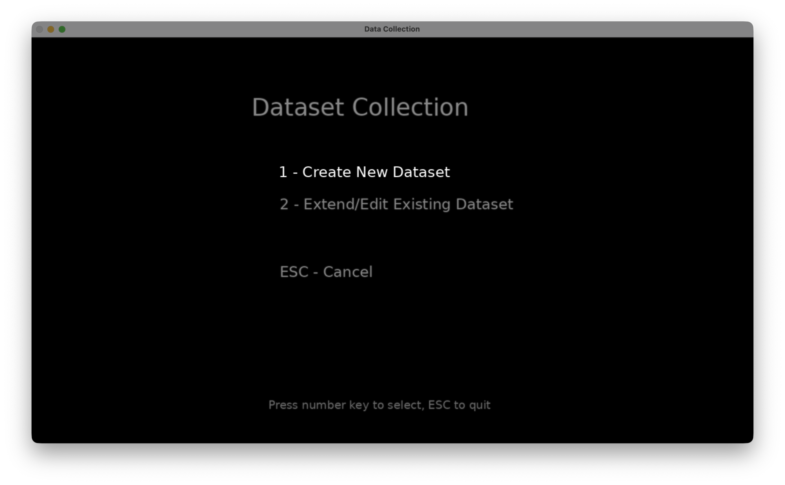
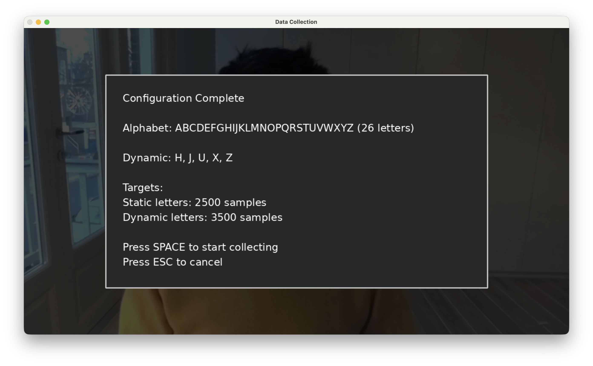
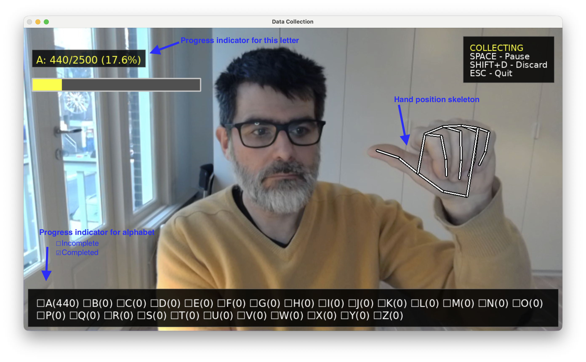
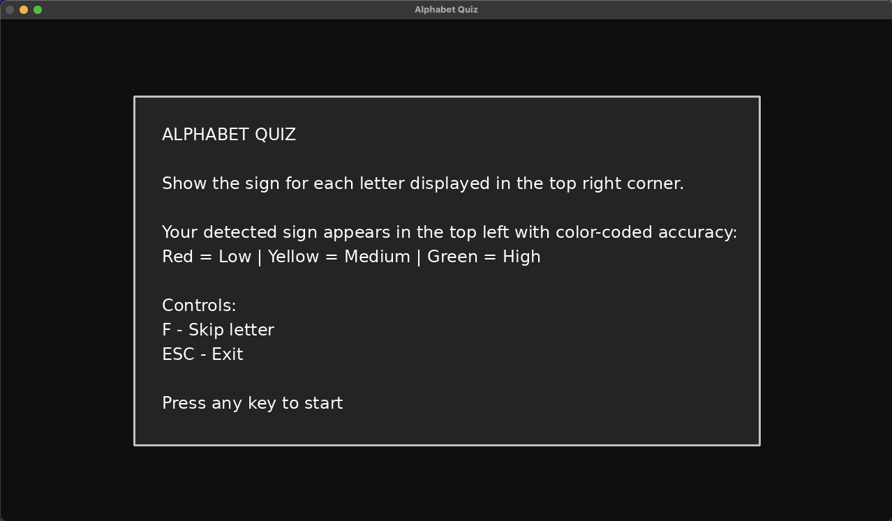
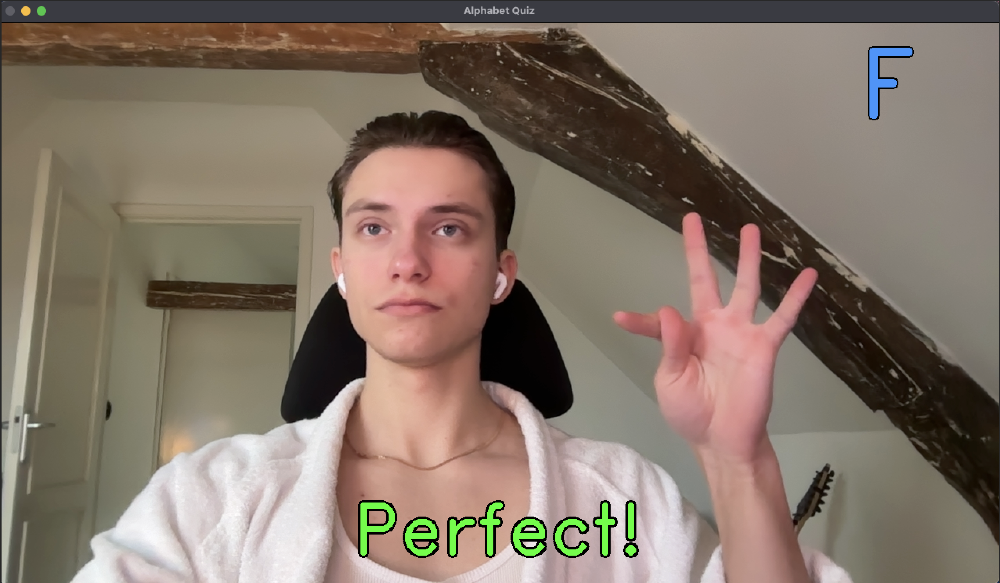

# FingerSpell <!-- omit from toc -->

Finger Spelling Practice in Python

**Table of Contents**

- [Project Description](#project-description)
- [Setup](#setup)
- [Training and Extending Models](#training-and-extending-models)
- [Alphabet Quiz](#alphabet-quiz)
- [Development Approach](#development-approach)
- [Next Steps](#next-steps)
- [Sources Cited](#sources-cited)


**Authors:**

- [Andrii Rak](https://andrii-123.github.io/resume.pdf)
- [Yuliia Medun](https://yuliiamedun.github.io/Resume_Yuliia_Medun.pdf)
- [Aaron Ciuffo](https://txoof.github.io/cv_resume/)

## Project Description

This project offers Nederlanse Gebaren Taal Vingeralfabet (NGT Finger Alphabet) training for beginners. The model signs are based on the examples provided by [Wapperkids YouTube Video](https://www.youtube.com/watch?v=GMi9qDSw2o8). It can also be trained to work with **your** local language!

The AI models used in this project benefit from learning from additional examples. Adding more examples of hand positions can help the models become more accurate. It is also possible to train an entirely new model for regional variations or entirely new alphabets.

It is possible to do the following:

- Add additional samples to an existing data set to improve accuracy
- Create brand new AI models for new static and dynamic signs for almost any single-handed finger-spelling language
- Build custom models for extended alphabets

## Setup

This assumes a basic comfort with Python, creating virtual environments and working on the command line. 

**Requirements**

- Web Camera
- Python 3.10 environment

### Environment Setup & Launch

1. Create a virtual environment for this project: `python3.10 -m venv fingerspell_venv`
2. Activate the virtual env: `source ./fingerspell_venv/bin/activate`
3. Install required packages: `pip install -r requirements.txt`
4. Launch the application: `./fingerspell.py`

## Training and Extending Models

The default models included in this project were trained by the authors. The authors are novice finger spellers that have learned NGT, the Nederlanse Gebaren Taal Vinger Alfabet (Dutch Sign Language Alphabet) from watching example videos. The quality of these signs may not be of a high enough quality for educational purposes, but do serve as a proof-of-concept model and project.

We have provided a structure that allows end users to train additional models, or improve existing models created with this project.

### Creating a New Alphabet Model

You will need to be able to type all the characters of your alphabet and understand the difference between a dynamic and static sign. 

**Dynamic Signs**: A gesture involving movement, speed, and changing hand shapes over time to represent a character, rather than a single, stationary pose.

**Static Signs**: A single stationary pose involving no hand movement or change in shape over time to represent a character.

### Training Tips

**Avoid big movements.** Keep your hand steady within the frame. The model learns finger, wrist and palm positions. If you move around a quickly, it learns less accurately.

**Use good lighting.** If you don't see a steady "skeleton" drawn over your hand while training, the model isn't learning. If the skeleton jumps around wildly even though your hand is still, the model is learning "bad" positions. Try:

- improving the lighting
- moving back from the camera a little
- holding your hand more still

**Use one hand for all the signs you teach the model** If you typically finger spell with your right hand, use your right hand for all the examples you provide. The models will automatically learn to understand symbols created with the left hand of other users.

**Take breaks!** You need to collect a lot of samples. It can be tiresome to make the same letter for several minutes. You can pause the collection with the space bar and even save your work and come back later.

**Get friends to help!** The more people the model can learn from, the better! You can save your work and add to it later.

**Delete mistakes!** If you are training the model how to learn "G" and accidentally sign "H", the model will be less accurate. You can pause training and use "Shift+D" to DELETE several of the gathered samples. When in doubt, delete more so the model doesn't learn bad habits!

**Vary your hand position.** Rotate your hand slightly and tip it forward and back while training. The model learns the angle and position of your fingers, palm and wrist. Move your hand around a bit to give it a chance to learn subtle variations in how you or others might make the same letter sign.

### Gathering Data

You will need to provide examples of hand positions for each letter. Follow these steps to teach the model a new alphabet.

1. From within the application Choose `1. Collect Training Data`



2. Choose `2. Create New Dataset`



3. Input the characters you wish to use in your alphabet. For example `ABCDEFGHIJKLMNOPQRSTUVWXYZÆØÅ`
4. Specify which letters are made using a dynamic sign.
   - Static signs work best with approximately 2500 collected examples
    - Dynamic signs work best with approximately 3500 collected examples



1. Press the space bar to start collecting examples. Collection will start with the first letter in your alphabet.
   - Collection starts paused and allows you to get your hand into position
   - Press the space bar to start collecting. The model is learning "good data" if the skeleton is steady and unmoving
   - When the status bar is full/reaches 100% you can move on to the next letter



6. Advance to the next letter by pressing that letter on the keyboard. 
   - TIP: If you need a break, press ESC to save your progress

7. After all letters are completed save your work. It will be saved on your desktop in the format `fingerspell_your_provided_name_YYYYMMDD_HHMM`

#### Training

Once you have collected signs, you need to train new AI models.

1. Open the application and choose option `Train Models`'
2. Choose the data from the list provided
     - Hint: Press the number matching the folder you wish to use
3. The training will complete in around 10-90 seconds depending on how many samples you have and your computerhardware and save to your desktop using the format `fingerspell_models_YYYYMMDD_HHMM`
     - Hint: You can rename this folder, but it must remain on your desktop
4. Choose `Load Custom Models` and then `Run Recognition` to try your models out!

## Alphabet Quiz

The Alphabet Quiz is a fun way to practice fingerspelling. Select option 5 from the main menu to start.



After reading the rules, press any key to begin. The letter you need to sign appears in the top right corner. Your detected sign and confidence level appear in the top left, color-coded: red (low), yellow (medium), or green (high confidence). Once the model reaches 80% confidence, a congratulation message appears and you move to the next letter.

**Controls:**
- **F** - Skip to next letter
- **ESC** - Exit quiz



After completing all letters, a victory screen appears. Press any key to return to the main menu.

## Development Approach

### The Challenge

The primary technical challenge in NGT fingerspelling recognition is distinguishing between static and dynamic letters:

- **Static letters** (A, B, C, D, E, F, G, I, K, L, M, N, O, P, Q, R, S, T, V, W, Y): Finger and hand positions remain fixed once the letter is formed. These can be recognized from a single frame.
- **Dynamic letters** (H, J, U, X, Z): The hand sign is formed with fingers in a static shape, but the entire hand moves, twists, or rotates in one or more planes and axes. These require temporal information to recognize correctly.

### Technical Background

This project uses two types of machine learning models:

- **Convolutional Neural Networks (CNN)**: Deep learning models that excel at pattern recognition in data. CNNs are very good at recognizing features like shapes and forms automatically but require substantial training time and computational resources.
- **Random Forest**: Models that make predictions by combining multiple decisions. They train quickly and work well with structured numerical data like hand landmark coordinates.

### Initial Development Timeline

Initial development took place from January 19-22, 2026, progressing through four iterations. Work continued through 30 January, adding features and improving performance.

#### Iteration 1: Proof of Concept (Random Forest)

- Collected approximately 200 samples per static letter and 400 samples per dynamic letter. 
- Trained a single Random Forest classifier on MediaPipe hand landmarks (21 3D points = 63 features). 
- Results showed high accuracy and fast training times, validating the approach for static letters.

#### Iteration 2: Dual Model System

- Created separate Random Forest models for static and dynamic letters. 
- Implemented a basic supervisor component to route predictions based on hand movement detected in individual frames.
- Static letters performed well, but dynamic letter accuracy remained low due to insufficient motion information.

#### Iteration 3: Neural Network Approach

We wanted to explore existing solutions and datasets to avoid "reinventing the wheel". We found the [ashgadala/american-sign-language-detection](https://github.com/ashgadala/american-sign-language-detection) ASL fingerspelling recognition project to be a good jumping off point for trying CNN models.

- Adopted code and data structure from the [ASL](https://github.com/ashgadala/american-sign-language-detection) detection project.
- Collected new training data for NGT letters that differ from ASL (approximately 60% of the alphabet). 
- Trained a CNN achieving 99% overall accuracy with excellent precision, recall, and F1 scores across all letters.

**CNN Classification Results:**

```text
              precision    recall  f1-score   support
    accuracy                           0.99      7891
   macro avg       0.99      0.99      0.99      7891
weighted avg       0.99      0.99      0.99      7891
```


Despite strong performance metrics, the CNN approach had critical limitations:

- Dynamic letters registered intermittently because the model received individual frames without temporal context
- No frame buffering was implemented to capture motion patterns
- Training required significant time (minutes to hours), making rapid iteration difficult
- Implementing context windows (concatenating multiple frames) felt overly complex for the project timeline

#### Iteration 4: Enhanced Dual Random Forest System (Final Solution)

Returned to the dual Random Forest approach with significant improvements to motion detection and feature engineering.

**Key Innovation - Delta Features:**

MediaPipe normalizes hand landmarks by setting the wrist as the origin, which removes absolute position information needed for motion detection. To capture movement, we implemented delta features that measure landmark position changes across a 5-frame window:

- Calculate the difference in each landmark's normalized position between consecutive frames
- Aggregate these differences to detect movement across all 21 hand joints
- High delta values indicate motion is occurring

The motion detection system uses two metrics:

1. **Total landmark displacement**: Sum of all position changes across all joints
2. **Absolute wrist displacement**: Movement of the wrist in the original (non-normalized) coordinate space

This dual-metric approach achieves 96.7% accuracy in classifying frames as static or dynamic motion.

**Model Architecture:**

```text
Camera Feed
     |
     v
MediaPipe Hand Detection
     |
     v
Motion Detection (5-frame buffer)
     |
     v
Supervisor Component
     |
     +-- Static motion detected --> Static Random Forest (21 letters, 42 features)
     |
     +-- Dynamic motion detected --> Dynamic Random Forest (5 letters, 84 features)
     |
     v
Letter Prediction
```

**Final Results:**

Static Letter Model (21 letters):

```text
              precision    recall  f1-score   support
weighted avg       1.00      0.99      0.99      8582
```

Dynamic Letter Model (5 letters):

```text
              precision    recall  f1-score   support
             H       1.00      1.00      1.00       805
             J       1.00      1.00      1.00       603
             U       1.00      1.00      1.00       516
             X       1.00      1.00      1.00       693
             Z       0.99      0.99      0.99       609

      accuracy                           1.00      3226
    macro avg       1.00      1.00      1.00      3226
 weighted avg       1.00      1.00      1.00      3226
```

### Key Lessons

1. **Normalization matters**: MediaPipe's wrist-centered normalization is essential for position-invariant hand shape recognition, but it removes motion information. Capturing both normalized and raw coordinates solved this challenge.

2. **Delta features as motion proxy**: Computing position differences across frame windows provides an effective, interpretable way to capture movement patterns without complex temporal modeling.

3. **Model simplicity enables iteration**: Random Forest models train in seconds rather than minutes, allowing rapid experimentation with features, data collection strategies, and model architectures.

## Next Steps

### Data Quality Improvements
- Collect training data from certified NGT instructors to ensure correct signing technique (current data was collected by non-expert team members and can contain errors).

### Enhanced Learning Features
- Implement guided practice mode with step-by-step tutorials, providing real-time feedback to help beginners learn correct hand shapes and movements.
- Provide personalized feedback by identifying common mistakes based on user performance, such as incorrect finger positioning or inconsistent motion in dynamic letters.

### Word Recognition
- Create word-level and number recognition for fingerspelled words.

## Sources Cited

### References

| Source                                                                                                      | Description                                                               | Usage                                                                              | License                                                                                |
| ----------------------------------------------------------------------------------------------------------- | ------------------------------------------------------------------------- | ---------------------------------------------------------------------------------- | -------------------------------------------------------------------------------------- |
| [ashgadala/american-sign-language-detection](https://github.com/ashgadala/american-sign-language-detection) | ASL fingerspelling recognition dataset                                    | Used data structure and training data for letters that overlap between ASL and NGT | [MIT](https://github.com/ashgadala/american-sign-language-detection/blob/main/LICENSE) |
| [Wapperkids NLGebaren doe je zo ALFABET](https://www.youtube.com/watch?v=GMi9qDSw2o8)                       | Reference video demonstrating Dutch Sign Language fingerspelling alphabet | Used as reference material for correct NGT letter formation                        |                                                                                        |
| [NGT Handalfabet by Vera de Kok](https://nl.wikipedia.org/wiki/Bestand:NGT_handalfabet.webm)                | Reference video demonstrating Dutch Sign Language fingerspelling alphabet | Used as reference material for correct NGT letter formation                        | [CC BY-SA 4.0](https://creativecommons.org/licenses/by-sa/4.0/)                        |

### Fonts

This project includes DejaVu Sans font for Unicode text rendering:

**DejaVu Sans**
- License: DejaVu Fonts License (based on Bitstream Vera Fonts and Public Domain)
- Source: https://dejavu-fonts.github.io/
- Files: `assets/fonts/DejaVuSans.ttf`, `DejaVuSans-Bold.ttf`

The DejaVu fonts are free to use, modify, and distribute. See `[assets/fonts/DejaVu Fonts Licenses.txt](./assets/fonts/DejaVu Fonts License.txt)` for full license text.
